# Laboratorio 7 - Documentación de indicadores de dashboard

## Tab 1 — Persona 2: Estructura Organizacional

Objetivo: mostrar cómo está distribuida la fuerza laboral.

### Indicador 1: Cantidad de empleados por tienda
- **Qué representa:** número total de empleados asignados a cada tienda.
- **Importancia:** identifica el tamaño de la fuerza laboral de cada local y permite comparar capacidad operativa.
- **Tipo de visualización:** gráfico de barras (bar chart) o tabla ordenada.
- **Justificación:** una vista rápida de cuántos colaboradores tiene cada tienda ayuda en la distribución de recursos y en la planificación de personal.
- **Query SQL:**
```sql
SELECT t.id_tienda,
       t.nombre,
       COUNT(e.id_empleado) AS empleados
FROM tienda t
LEFT JOIN empleado e ON e.id_tienda = t.id_tienda
GROUP BY t.id_tienda, t.nombre
ORDER BY empleados DESC;
```

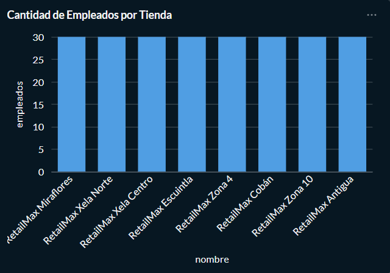

### Indicador 2: Distribución por puesto
- **Qué representa:** cantidad de empleados agrupados por `puesto`.
- **Importancia:** muestra la composición de roles dentro de la fuerza laboral.
- **Tipo de visualización:** gráfico de barras, treemap o donut.
- **Justificación:** permite ver si la organización está más enfocada en ventas, operaciones, administración u otros roles.
- **Query SQL:**
```sql
SELECT puesto,
       COUNT(*) AS cantidad
FROM empleado
GROUP BY puesto
ORDER BY cantidad DESC;
```

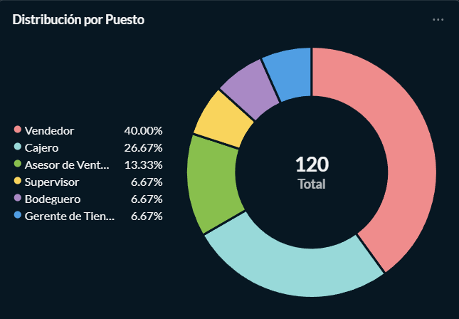

### Indicador 3: Distribución salarial por región
- **Qué representa:** salario promedio y mediano por `region` de tienda.
- **Importancia:** compara niveles salariales geográficos y ayuda a detectar diferencias entre regiones.
- **Tipo de visualización:** barras, boxplot o tabla con salario promedio.
- **Justificación:** si las tiendas tienen el mismo número de empleados, las diferencias en salario promedio reflejan la estructura de roles y el costo laboral.
- **Query SQL:**
```sql
SELECT t.region,
       COUNT(e.id_empleado) AS empleados,
       AVG(e.salario)::numeric(12,2) AS salario_promedio,
       PERCENTILE_CONT(0.5) WITHIN GROUP (ORDER BY e.salario) AS mediana
FROM empleado e
JOIN tienda t ON e.id_tienda = t.id_tienda
GROUP BY t.region
ORDER BY salario_promedio DESC;
```

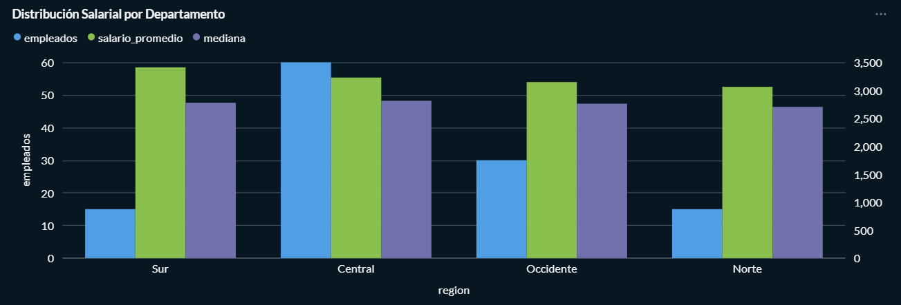

### Indicador 4: Antigüedad promedio por tienda
- **Qué representa:** años promedio de antigüedad de los empleados en cada tienda.
- **Importancia:** muestra cuáles tiendas tienen personal más experimentado o más nuevo.
- **Tipo de visualización:** gráfico de barras o KPI cards por tienda.
- **Justificación:** ayuda a detectar tiendas con alta rotación o con base de empleados estable.
- **Query SQL:**
```sql
SELECT t.id_tienda,
       t.nombre,
       AVG(date_part('year', age(current_date, e.fecha_contratacion))) AS antiguedad_promedio_anos,
       COUNT(e.id_empleado) AS empleados
FROM tienda t
LEFT JOIN empleado e ON e.id_tienda = t.id_tienda
GROUP BY t.id_tienda, t.nombre
ORDER BY antiguedad_promedio_anos DESC;
```

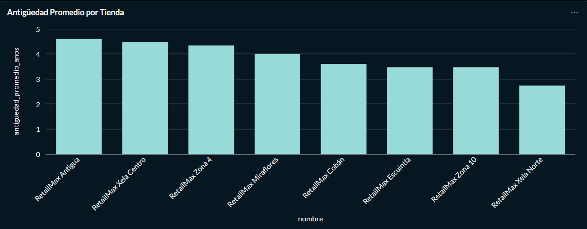

### Indicador 5: Top tiendas con más empleados
- **Qué representa:** tiendas con mayor número de empleados.
- **Importancia:** identifica los hubs de personal más grandes.
- **Tipo de visualización:** tabla o gráfico de barras con top N.
- **Justificación:** permite priorizar atención operativa y detectar dónde se concentra la mayor parte de la fuerza laboral.
- **Query SQL:**
```sql
SELECT t.id_tienda,
       t.nombre,
       COUNT(e.id_empleado) AS empleados
FROM tienda t
LEFT JOIN empleado e ON e.id_tienda = t.id_tienda
GROUP BY t.id_tienda, t.nombre
ORDER BY empleados DESC
LIMIT 10;
```

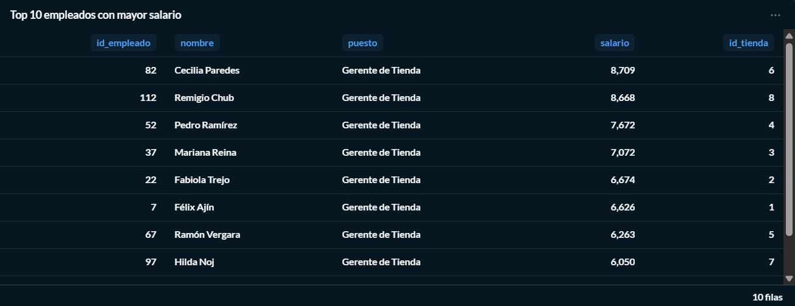

### Indicador 6: Relación empleados administrativos vs operativos
- **Qué representa:** proporción entre empleados administrativos y operativos según el contenido del campo `puesto`.
- **Importancia:** muestra el equilibrio entre funciones de soporte y de operación directa.
- **Tipo de visualización:** donut chart, stacked bar o KPI cards de porcentaje.
- **Justificación:** ayuda a evaluar si hay demasiada carga administrativa comparada con la fuerza operativa.
- **Query SQL:**
```sql
SELECT
  SUM(CASE WHEN puesto ILIKE '%admin%' OR puesto ILIKE '%geren%' OR puesto ILIKE '%encarg%' THEN 1 ELSE 0 END) AS administrativos,
  SUM(CASE WHEN puesto ILIKE '%oper%' OR puesto ILIKE '%vendedor%' OR NOT (puesto ILIKE '%admin%' OR puesto ILIKE '%geren%' OR puesto ILIKE '%encarg%') THEN 1 ELSE 0 END) AS operativos,
  COUNT(*) AS total_empleados,
  ROUND(100.0 * SUM(CASE WHEN puesto ILIKE '%admin%' OR puesto ILIKE '%geren%' OR puesto ILIKE '%encarg%' THEN 1 ELSE 0 END) / NULLIF(COUNT(*),0),2) AS pct_administrativos
FROM empleado;
```

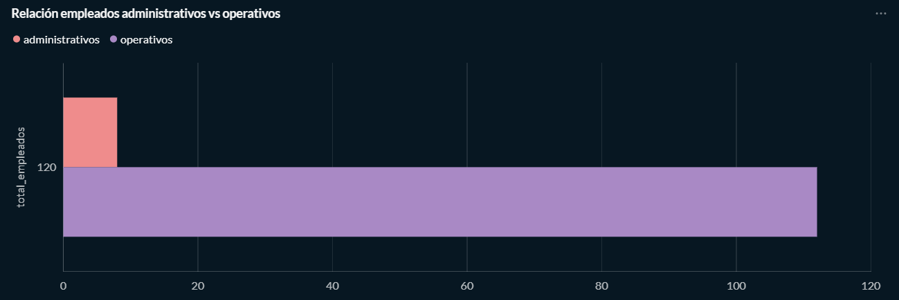

### Indicador 7: Carga de trabajo por empleado por tienda
- **Qué representa:** número de pedidos por empleado en cada tienda.
- **Importancia:** revela la carga operativa real cuando la cantidad de empleados es similar entre tiendas.
- **Tipo de visualización:** gráfico de barras o tabla KPI.
- **Justificación:** muestra qué tiendas trabajan más por colaborador, ayudando a dimensionar la productividad y la presión operativa.
- **Query SQL:**
```sql
SELECT t.id_tienda,
       t.nombre,
       COUNT(DISTINCT e.id_empleado) AS empleados,
       COUNT(DISTINCT p.id_pedido) AS pedidos,
       ROUND(COUNT(DISTINCT p.id_pedido)::numeric / NULLIF(COUNT(DISTINCT e.id_empleado), 0), 2) AS pedidos_por_empleado
FROM tienda t
LEFT JOIN empleado e ON e.id_tienda = t.id_tienda
LEFT JOIN pedido p ON p.id_tienda = t.id_tienda
GROUP BY t.id_tienda, t.nombre
ORDER BY pedidos_por_empleado DESC;
```

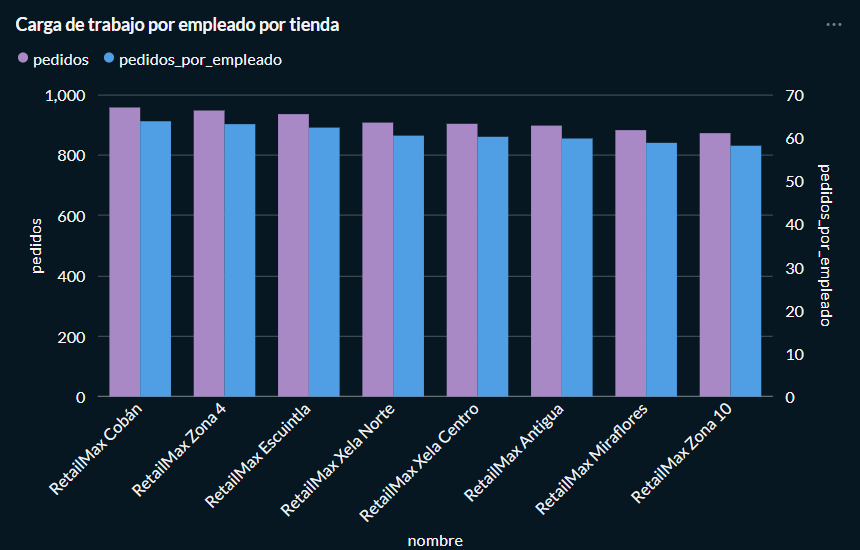

---

## Tab 2 — Persona 3: Compensaciones y Rendimiento

Objetivo: análisis financiero y laboral de costos salariales y desempeño.

### Indicador 1: Salario promedio por puesto
- **Qué representa:** promedio de salario para cada rol.
- **Importancia:** permite comparar compensaciones internas entre puestos.
- **Tipo de visualización:** gráfico de barras.
- **Justificación:** útil para detectar roles con mayor o menor remuneración relativa.
- **Query SQL:**
```sql
SELECT puesto,
       AVG(salario)::numeric(12,2) AS salario_promedio,
       COUNT(*) AS empleados
FROM empleado
GROUP BY puesto
ORDER BY salario_promedio DESC;
```

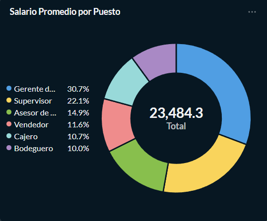

### Indicador 2: Costo total de nómina por tienda
- **Qué representa:** suma de salarios de los empleados en cada tienda.
- **Importancia:** muestra el peso del costo laboral por punto de venta.
- **Tipo de visualización:** barras o tabla ordenada.
- **Justificación:** sirve para presupuestar y comparar impacto de nómina por tienda.
- **Query SQL:**
```sql
SELECT t.id_tienda,
       t.nombre,
       SUM(e.salario)::numeric(14,2) AS total_nomina
FROM empleado e
JOIN tienda t ON e.id_tienda = t.id_tienda
GROUP BY t.id_tienda, t.nombre
ORDER BY total_nomina DESC;
```

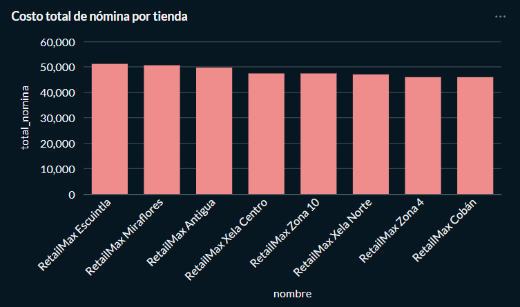

### Indicador 3: Top 10 empleados con mayor salario
- **Qué representa:** empleados con salarios más altos.
- **Importancia:** detecta outliers y posibles casos críticos de costo laboral.
- **Tipo de visualización:** tabla o barras horizontales.
- **Justificación:** ayuda en auditoría de sueldos y en decisiones de retención.
- **Query SQL:**
```sql
SELECT id_empleado,
       nombre,
       puesto,
       salario,
       id_tienda
FROM empleado
ORDER BY salario DESC
LIMIT 10;
```


### Indicador 4: Comparación salarial entre regiones
- **Qué representa:** salario promedio por región de la tienda.
- **Importancia:** revela brechas salariales geográficas.
- **Tipo de visualización:** barras agrupadas o tabla con regiones.
- **Justificación:** clave para analizar equidad salarial por ubicación.
- **Query SQL:**
```sql
SELECT t.region,
       AVG(e.salario)::numeric(12,2) AS salario_promedio,
       COUNT(*) AS empleados
FROM empleado e
JOIN tienda t ON e.id_tienda = t.id_tienda
GROUP BY t.region
ORDER BY salario_promedio DESC;
```

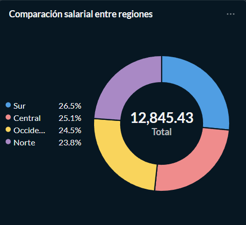

### Indicador 5: Evolución mensual de costos salariales
- **Qué representa:** tendencia de la nómina mensual a lo largo del tiempo.
- **Importancia:** permite identificar picos, crecimientos y patrones de costo.
- **Tipo de visualización:** línea temporal (line chart).
- **Justificación:** útil para el análisis financiero y la planificación presupuestaria.
- **Query SQL:**
```sql
WITH meses AS (
  SELECT generate_series(
           date_trunc('month', (SELECT MIN(fecha_contratacion) FROM empleado)),
           date_trunc('month', current_date),
           interval '1 month') AS mes_inicio
)
SELECT m.mes_inicio,
       SUM(e.salario)::numeric(14,2) AS total_nomina_mes
FROM meses m
JOIN empleado e ON e.fecha_contratacion <= (m.mes_inicio + interval '1 month' - interval '1 day')
GROUP BY m.mes_inicio
ORDER BY m.mes_inicio;
```

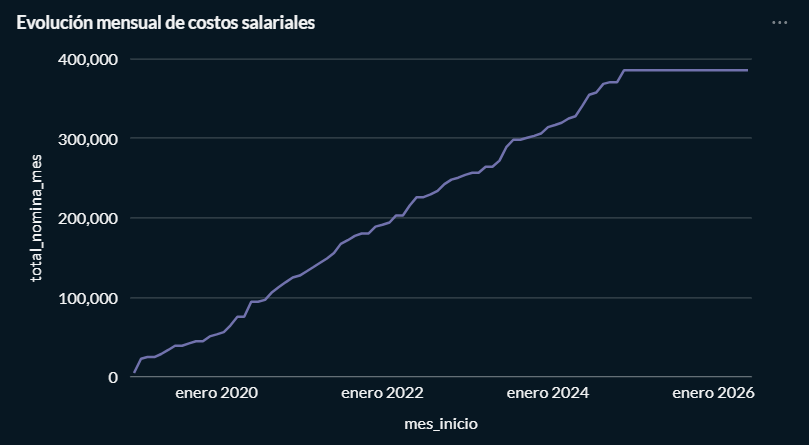

### Indicador 6: Porcentaje de pedidos devueltos por tienda
- **Qué representa:** proporción de pedidos devueltos respecto al total de pedidos de cada tienda.
- **Importancia:** relaciona el rendimiento comercial con la calidad del servicio y la operación.
- **Tipo de visualización:** barras apiladas, donut o tabla de porcentaje.
- **Justificación:** es un indicador útil usando solo las tablas existentes (`tienda`, `pedido`, `devolucion`) y muestra un aspecto de desempeño operacional.
- **Query SQL:**
```sql
SELECT t.id_tienda,
       t.nombre,
       COUNT(p.id_pedido) AS pedidos_totales,
       COUNT(d.id_devolucion) AS devoluciones,
       ROUND(100.0 * COUNT(d.id_devolucion) / NULLIF(COUNT(p.id_pedido),0), 2) AS pct_devoluciones
FROM tienda t
LEFT JOIN pedido p ON p.id_tienda = t.id_tienda
LEFT JOIN devolucion d ON d.id_pedido = p.id_pedido
GROUP BY t.id_tienda, t.nombre
ORDER BY pct_devoluciones DESC;
```

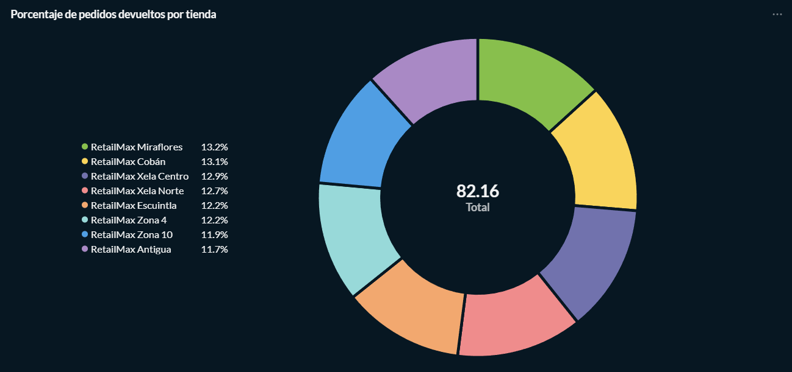


